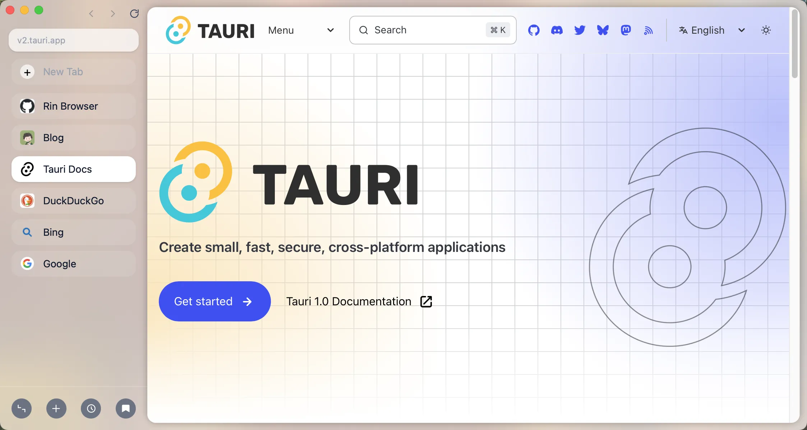

<div align="center">

<div style="margin: 20px 0;">
  
</div>

# 🚀 Rin Browser: An experimental lightweight browser built with Tauri.

<p>
  <a href="README.md">English</a> |
  <a href="README-zh.md">中文</a>
</p>

</div>

---

# Rin Browser (Experimental)



---

## ⚠️ Warning

This is an experimental project for learning and exploration purposes only. The current version is not suitable for production use. Use at your own risk.

---

## Project Overview

Rin Browser is a minimal desktop browser prototype built with **React, TypeScript, Vite, and Tauri 2**.
It aims to provide a simple and fast browsing experience while integrating a multi-tab UI with native WebView via Tauri.

- **Tech Stack:** `React`, `TypeScript`, `Vite`, `Tauri 2`

**Main Goals:**

- Fast web browsing
- Multi-tab management
- Experimental search-enhanced features

---

## 🚀 Features (Early Stage)

- [x] Multi-tab management
- [x] Address bar input & navigation
- [x] Back / Forward / Reload
- [ ] Multi-window support
- [ ] Keyboard shortcuts
- [ ] Page content summarization
- [ ] Cookie / Session management
- [ ] Information integration & analysis
- [ ] Bookmarks & history
- [ ] File downloads
- [ ] AI-powered tag management
- [ ] Performance optimization (WebView related)
- [ ] Ad & tracker blocking

> Features are still under rapid iteration; APIs and experience may change at any time.

## 📁 Directory Structure

- `src/` — Frontend React code
- `src-tauri/` — Tauri 2 (Rust backend)

## 🛠 Environment Requirements

- Node.js `>= 18`
- Package manager: `pnpm`
- Rust toolchain (via `rustup`)
- Tauri 2 dependencies: https://tauri.app/start/prerequisites

## ⚡ Quick Start

### Install Dependencies

```bash
pnpm install
```

> Make sure the Rust toolchain is installed and check with `rustc -V`

### Run in Development Mode (Desktop App)

```bash
pnpm tauri dev
```

### Build (Generate Installer)

```bash
pnpm tauri build
```

---

## ❓ FAQ

- **Environment Check**
  - Node.js >= 18 (`node -v`)
  - Rust toolchain (`rustc -V`)
- **Dependency Errors**
  - Ensure Tauri dependencies are correctly installed for your OS

---

## 🔒 Security & Stability

- Full production-level security measures are not yet implemented
- Features may be incomplete; experience may change
- Not recommended for handling sensitive data or long-term browsing

---

## 🤝 Contributing & Contact

- Feel free to fork or submit a PR
- Report bugs or suggestions via [GitHub Issues](https://github.com/calebax/Rin/issues)
- Note: This project is still experimental; stability is not guaranteed

---

## 📖 References

- [Tauri Official Documentation](https://tauri.app/)
- [React Official Documentation](https://reactjs.org/)
- [TypeScript Official Documentation](https://www.typescriptlang.org/)
